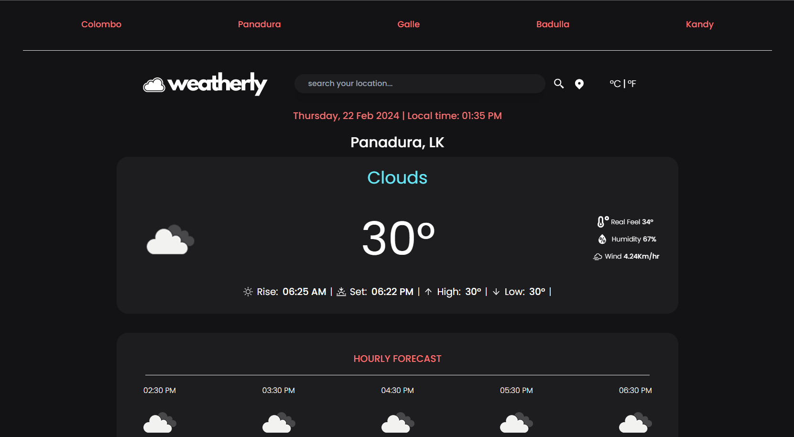

<br/>
<p align="center">
  <a href="https://github.com/harshana-lk/react-weather-app">
    
  </a>

  <h3 align="center">Weatherly - React Weather App</h3>

  <p align="center">
    An Awesome Weather App Project
    <br/>
    <br/>
    <a href="https://github.com/harshana-lk/react-weather-app">View Demo</a>
    .
  </p>
</p>

     

## About The Project



Introducing Weatherly: Your Personal Meteorological Companion

Weatherly is your go-to weather app for staying informed and prepared for whatever Mother Nature has in store. With a sleek and intuitive interface, WeatherEase provides accurate and up-to-date weather forecasts tailored to your location, ensuring you're always one step ahead of changing weather conditions.

Key Features:

1. **Real-Time Updates**: Get instant access to current weather conditions, including temperature, humidity, wind speed, and more, all updated in real-time.

2. **Hourly and Daily Forecasts**: Plan your day with confidence using hourly and daily forecasts that provide detailed insights into expected weather patterns, precipitation levels, and temperature fluctuations.

3. **Interactive Radar**: Track storms and precipitation with our interactive radar feature, allowing you to zoom in and out for a closer look at weather activity in your area.

4. **Dark Mode Support**: Reduce eye strain and conserve battery life with our sleek dark mode option, perfect for nighttime use or prolonged viewing.

Weatherly is designed to be your reliable companion for all things weather-related, whether you're planning your daily commute, scheduling outdoor activities, or simply staying informed about the world around you. Download WeatherEase today and take control of your weather experience.

## Built With

Weatherly is a sleek and efficient weather app crafted with React, Tailwind CSS, and powered by the OpenWeather API. With seamless React routing, Weatherly provides users with a smooth and intuitive experience for accessing accurate weather forecasts. Whether you're planning your day or keeping an eye on the weather ahead, Weatherly simplifies your weather tracking needs with style and reliability.

## Getting Started

This is an example of how you may give instructions on setting up your project locally.
To get a local copy up and running follow these simple example steps.

### Prerequisites

This is an example of how to list things you need to use the software and how to install them.

- npm

```sh
npm install npm@latest -g
```

### Installation

1. Get a free API Key at [https://openweathermap.org/api](https://openweathermap.org/api)

2. Clone the repo

```sh
git clone https://github.com/harshana-lk/react-weather-app
```

3. Install NPM packages

```sh
npm install
```

4. Enter your API in `WeatherService.js`

```JS
const API_KEY = 'ENTER YOUR API';
```

## Authors

- **Harshana Jayaweera** - _CS Student_ - [Harshana Jayaweera](https://github.com/harshana-lk/) - _Built ReadME Template_

## Acknowledgements

- [Harshana Jayaweera](https://github.com/harshana-lk/)
- []()
- []()
